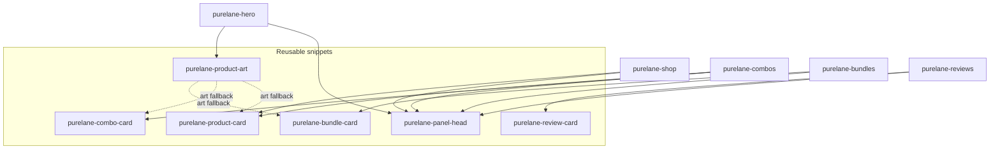
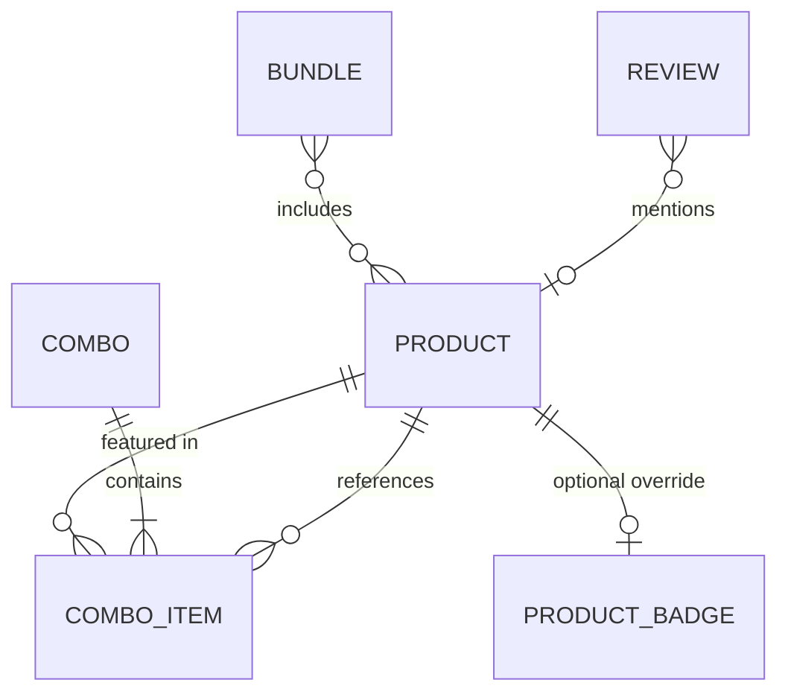
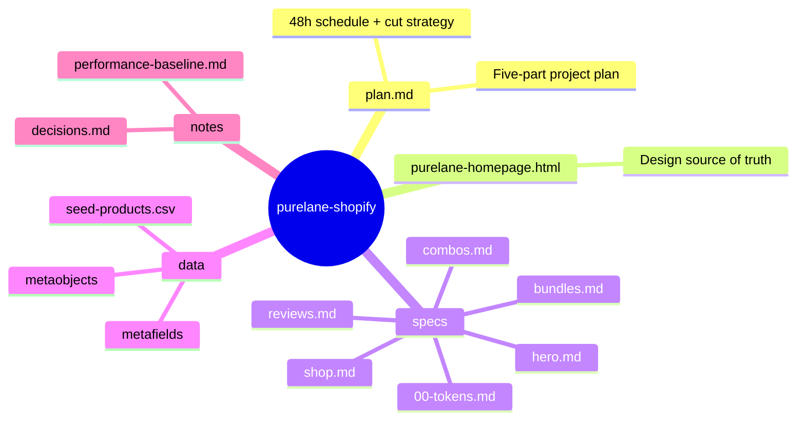

# Purelane — Shopify Theme Rebuild

**Troopod · AI Product Engineer assignment** — take a static design prototype and turn it into production Shopify theme sections a merchant's marketing team can run without a developer.

> **The design is the spec. The code is not.** Reproduce the visual output exactly; where the underlying HTML/CSS is wrong for production, fix it and say why.

---

## 📍 Where we are

| Part | Scope | Status |
|---|---|---|
| **1 · Recon & Spec** | Design audit, fix-list, five pixel-accurate section specs | ✅ **Committed** |
| **2 · Setup & Data** | Locked decisions, seed data, metaobject definitions | 🟡 Setup committed — **blocked on dev store credentials** |
| **3 · Build** | Five sections + shared snippets on stock Dawn | ⏳ Pending |
| **4 · QA & Hardening** | Pixel checks, theme-editor stress test, a11y, CWV | 🟡 In progress — harness + prototype baseline done; store/Part 3 checks pending |
| **5 · Delivery** | Notes, submission to `nj@troopod.io` | ⏳ Pending |

---

## 🎯 The mission

`purelane-homepage.html` (1716 lines, ~148 KB) is a fast-built design prototype for a plant-based homecare brand — single file, no dependencies, not written with Shopify in mind. We turn **five of its sections** into merchant-editable, data-driven Shopify sections on **stock Dawn**:

| # | Section | Prototype anchor | What it is |
|---|---|---|---|
| 01 | **Hero** | `section.hero` | Trust badges, headline, 3-slide product stage with price tags + dots |
| 02 | **Shop / product grid** | `#shop` | Collection-driven cards: badge, rating, price row, Add to cart |
| 03 | **Best-selling combos** | `#combos` | Snap-scroll rail of curated product groups |
| 04 | **Bundles** | `#bundles` | Starter / Most popular / Whole home tier cards |
| 05 | **Reviews rail** | `#reviews` | Auto-marquee of review cards with aggregates |

Everything else in the file (header, ingredients, proof, footer…) is bonus and ships only if the five pass QA.

---

## 🧱 Architecture

Every section is a schema-first Liquid section; cards they share live in reusable snippets.

**One key discovery during recon:** the prototype ships **two style blocks**. The dark "V1" palette is fully overridden by a "VERSION 2 — brand colours (light)" block, so the actually-rendered design is the light mint theme. All specs target **V2** (`specs/00-tokens.md`).

---

## 🗃️ Data model

Products, prices and content come from the platform. Where Shopify has no native field, we solved it with metaobjects so marketing can add/swap content in Admin without a developer.

- **`combo` + `combo_item`** → curated product groups with deal pricing; savings computed in Liquid (`compare_at − price`), never hardcoded
- **`bundle`** → tier cards; per-product line computed as `price ÷ count`
- **`review`** → marquee cards (stars, headline, quote, author, verified)
- **Badges** → driven by product tags (`bestseller` / `toprated` / `new`) with a `custom.badge` metafield override
- **Review aggregates** ("4.8 · 8,000+ · 12 lakh+") → merchant-editable section settings, since the platform has no native source without a reviews app

Definitions live in [`data/`](data/README.md) (seed CSV, metaobject JSON, badge metafield).

---

## 📋 The bar

- **Pixel-accurate** — exact layout, spacing, type, colour and behaviour from 375px up; a build, not a redesign
- **Merchant-editable** — nothing hardcoded that marketing would want to change
- **Real Shopify data** — products, prices, content from the platform
- **Reusable** — shared card snippets across sections
- **Survives the theme editor** — add/remove/reorder/reconfigure never breaks anything, animations included
- **Fast** — Core Web Vitals as a requirement, measured against a stock-Dawn baseline
- **Accessible** — keyboard, focus, contrast, reduced motion
- **Clean and reviewable** — code and commit history

---

## 🗂️ Repository map

---

## 🚀 Next steps

1. **Dev store** — Shopify Partner account + development store (INR), stock Dawn
2. **Part 3 build** — shared snippets → shop → hero → combos → bundles → reviews
3. **Part 4 QA** — pixel screenshots, theme-editor stress test, Lighthouse vs baseline
