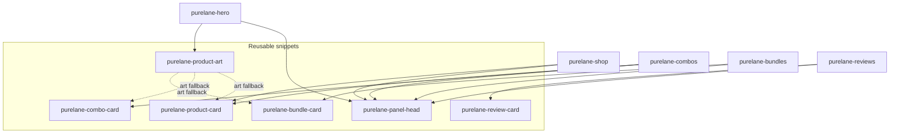
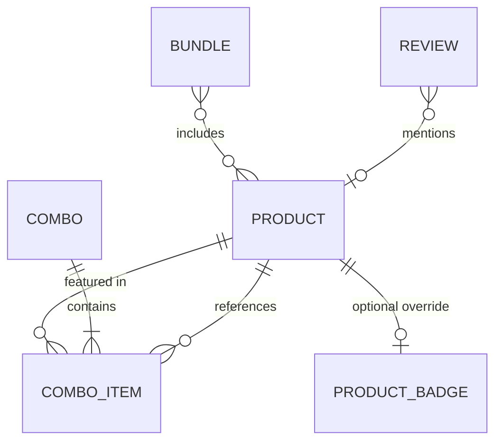
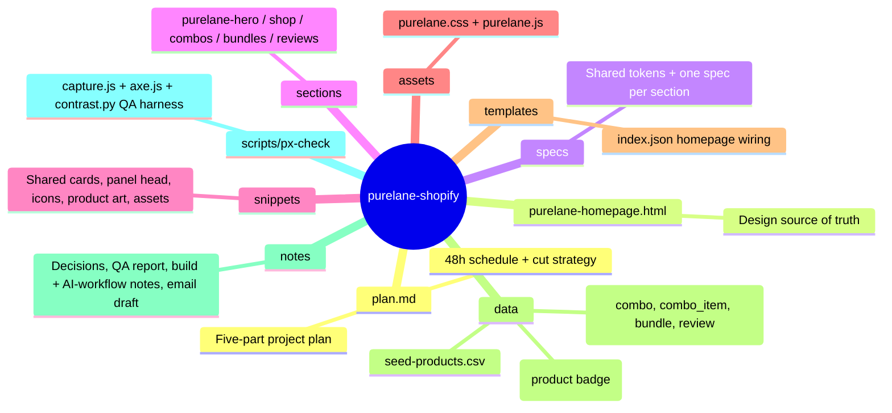

# Purelane — Shopify Theme Rebuild

**Troopod · AI Product Engineer assignment** — take a static design prototype and turn it into production Shopify theme sections a merchant's marketing team can run without a developer.

> **The design is the spec. The code is not.** Reproduce the visual output exactly; where the underlying HTML/CSS is wrong for production, fix it and say why.

---

## 📍 Where we are


| Part | Scope | Status |
|---|---|---|
| **1 · Recon & Spec** | Design audit, fix-list, five pixel-accurate section specs | ✅ Committed |
| **2 · Setup & Data** | Locked decisions, seed data, metaobject definitions | ✅ Committed — seeding steps ready (`data/README.md`) |
| **3 · Build** | Five sections + shared snippets + assets + homepage template | ✅ Committed, pushed to dev store, **live** |
| **4 · QA & Hardening** | Pixel harness, axe, contrast, perf reference | ✅ Post-review hardening pass applied + re-verified (a11y fixes, contrast re-tune, whole-number ratings, variant CTAs, reveal gating) — 4b stress test + final Lighthouse still need a human/credentials |
| **5 · Delivery** | Build/AI-workflow notes, submission draft | ✅ Committed + pushed — email ready (URL filled in; password filled in at send time, never committed) |

---

## 🎯 The mission

`purelane-homepage.html` (1716 lines, ~148 KB) is a fast-built design prototype for a plant-based homecare brand — single file, no dependencies, not written with Shopify in mind. We turn **five of its sections** into merchant-editable, data-driven Shopify sections on **stock Dawn**:

| # | Section | Prototype anchor | What it is |
|---|---|---|---|
| 01 | **Hero** | `section.hero` | Trust badges, headline, 3-slide product stage with price tags + dots |
| 02 | **Shop / product grid** | `#shop` | Collection-driven cards: badge, rating, price row, Add to cart |
| 03 | **Best-selling combos** | `#combos` | Snap-scroll rail of curated product groups |
| 04 | **Bundles** | `#bundles` | Starter / Most popular / Whole home tier cards |
| 05 | **Reviews rail** | `#reviews` | Auto-marquee of review cards with aggregates |

Everything else in the file (header, ingredients, proof, footer…) is bonus and ships only if the five pass QA.

---

## 🧱 Architecture

Every section is a schema-first Liquid section; cards they share live in reusable snippets.



**One key discovery during recon:** the prototype ships **two style blocks**. The dark "V1" palette is fully overridden by a "VERSION 2 — brand colours (light)" block, so the actually-rendered design is the light mint theme. All specs target **V2** (`specs/00-tokens.md`).

---

## 🗃️ Data model

Products, prices and content come from the platform. Where Shopify has no native field, we solved it with metaobjects so marketing can add/swap content in Admin without a developer.



- **`combo` + `combo_item`** → curated product groups with deal pricing; savings computed in Liquid (`compare_at − price`), never hardcoded
- **`bundle`** → tier cards; per-product line computed as `price ÷ count`
- **`review`** → marquee cards (stars, headline, quote, author, verified)
- **Badges** → driven by product tags (`bestseller` / `toprated` / `new`) with a `custom.badge` metafield override
- **Review aggregates** ("4.8 · 8,000+ · 12 lakh+") → merchant-editable section settings, since the platform has no native source without a reviews app

Definitions live in [`data/`](data/README.md) (seed CSV, metaobject JSON, badge metafield).

---

## 📋 The bar

- **Pixel-accurate** — exact layout, spacing, type, colour and behaviour from 375px up; a build, not a redesign
- **Merchant-editable** — nothing hardcoded that marketing would want to change
- **Real Shopify data** — products, prices, content from the platform
- **Reusable** — shared card snippets across sections
- **Survives the theme editor** — add/remove/reorder/reconfigure never breaks anything, animations included
- **Fast** — Core Web Vitals as a requirement, measured against a stock-Dawn baseline
- **Accessible** — keyboard, focus, contrast, reduced motion
- **Clean and reviewable** — code and commit history

---

## 🚀 How to run

### Prerequisites

- **Node.js 18+** and **Python 3.11+** — QA harness
- **Google Chrome** — pixel captures (harness drives the installed browser)
- **Shopify Partner account + development store** on stock Dawn (set to INR so ₹ renders) and the **Shopify CLI**

### 1. Deploy the theme to a store

This repo holds only the **custom parts** of a theme (sections, snippets, assets, homepage template). A Shopify theme also needs Dawn's stock files (`layout/`, `config/`, `locales/`, …) before it can be uploaded — so the deploy script assembles **stock Dawn + our files** into a complete theme, pushes it, and publishes it as live:

```bash
shopify login --store your-store.myshopify.com
STORE=your-store scripts/deploy-theme.sh        # assemble → push → publish
```

Or run the same steps manually:

```bash
shopify theme init dawn-base                     # 1. stock Dawn base
cp sections/purelane-*.liquid   dawn-base/sections/
cp snippets/purelane-*.liquid   dawn-base/snippets/
cp assets/purelane.css assets/purelane.js        dawn-base/assets/
cp templates/index.json                          dawn-base/templates/
cd dawn-base
shopify theme push --unpublished --theme "Purelane Dawn" --store your-store
shopify theme publish -t <theme-id> --store your-store -f
```

> Status: deployed + published on the assignment store (`purelane-dev-rzcwvlkv`, theme **Purelane Dawn**, Aug 2026).

`templates/index.json` wires the five Purelane sections onto the homepage in order; add/remove/reorder them from the theme editor like any Dawn section. To preview against real store data before pushing: `shopify theme dev` (it serves the local theme on `localhost:9292`; the storefront is password-gated, so the CLI will ask for the storefront password).

### 2. Seed the store (data)

Follow [`data/README.md`](data/README.md) in order:

1. **Products** — Admin → Products → Import → `data/seed-products.csv` (10 products incl. sold-out, no-image and long-title edge cases)
2. **Collection** "Shop" (tag `bestseller`) — picked in the shop section settings
3. **Metaobject definitions** — Admin → Settings → Custom data → create from `data/metaobjects/*.json` (`combo`, `combo_item`, `bundle`, `review`), then add entries
4. **Badge metafield** — Admin → Settings → Custom data → Metafields → from `data/metafields/product-badge.json`

### 3. Run the QA harness

```bash
cd scripts/px-check
npm install

node capture.js                                  # prototype baseline @ 375/768/1024/1440
PX_URL=http://localhost:9292 node capture.js     # capture the live build instead
node axe.js                                      # WCAG 2a–22aa accessibility scan
python contrast.py                               # WCAG AA contrast matrix (V2 palette)
```

Performance reference (prototype) — or point Lighthouse at `localhost:9292` for the live build:

```bash
python -m http.server 8123 --bind 127.0.0.1 --directory ../..
npx -y lighthouse http://127.0.0.1:8123/purelane-homepage.html \
  --only-categories=performance,accessibility \
  --output=json --output-path=out/lh.json \
  --chrome-path="C:/Program Files/Google/Chrome/Application/chrome.exe"
```

Details for every command: [`scripts/px-check/README.md`](scripts/px-check/README.md).

### 4. Where the docs live

| Need | Read |
|---|---|
| Why we built it this way | [`plan.md`](plan.md) — 5-part plan, decisions, cut strategy |
| Pixel spec of every section | [`specs/`](specs/) |
| QA evidence | [`notes/qa-report.md`](notes/qa-report.md) + `scripts/px-check/out/` |
| What we'd flag / do differently | [`notes/build-notes.md`](notes/build-notes.md), [`notes/ai-workflow-notes.md`](notes/ai-workflow-notes.md) |

---

## 🗂️ Repository map



---

## 🚀 Next steps

1. **Seed the store** — `data/seed-products.csv` + metaobjects + badge metafield (steps in [`data/README.md`](data/README.md)) so the shop/combos grids render real cards before review
2. **Theme-editor stress test (Part 4b)** — add/remove/reorder sections in the editor and watch console + animations (checklist in `plan.md`)
3. **Final Lighthouse pass (4d)** — identical command in `notes/performance-baseline.md` against the live storefront
4. Fill in the storefront password in `notes/submission-email.md` at send time and email `nj@troopod.io`
